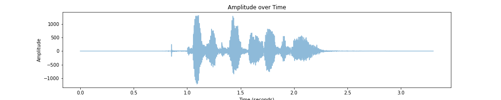
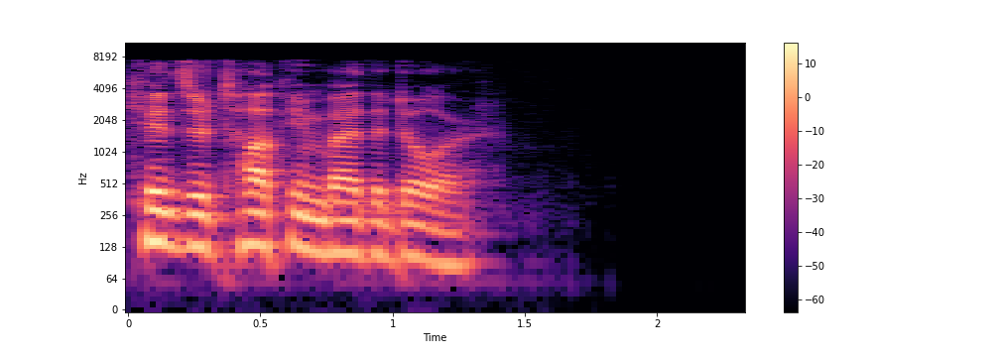
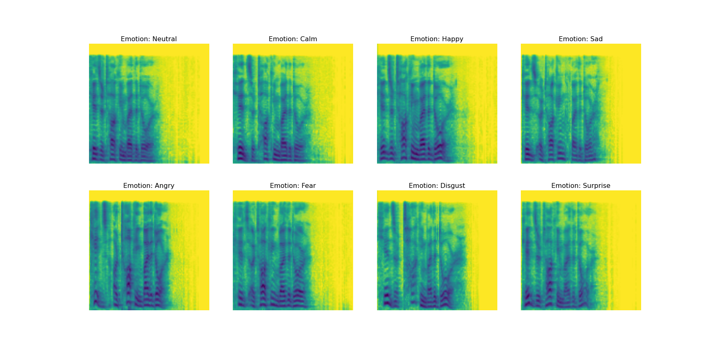
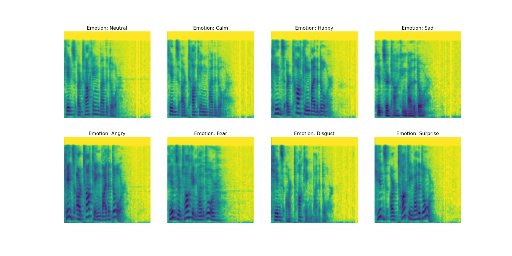
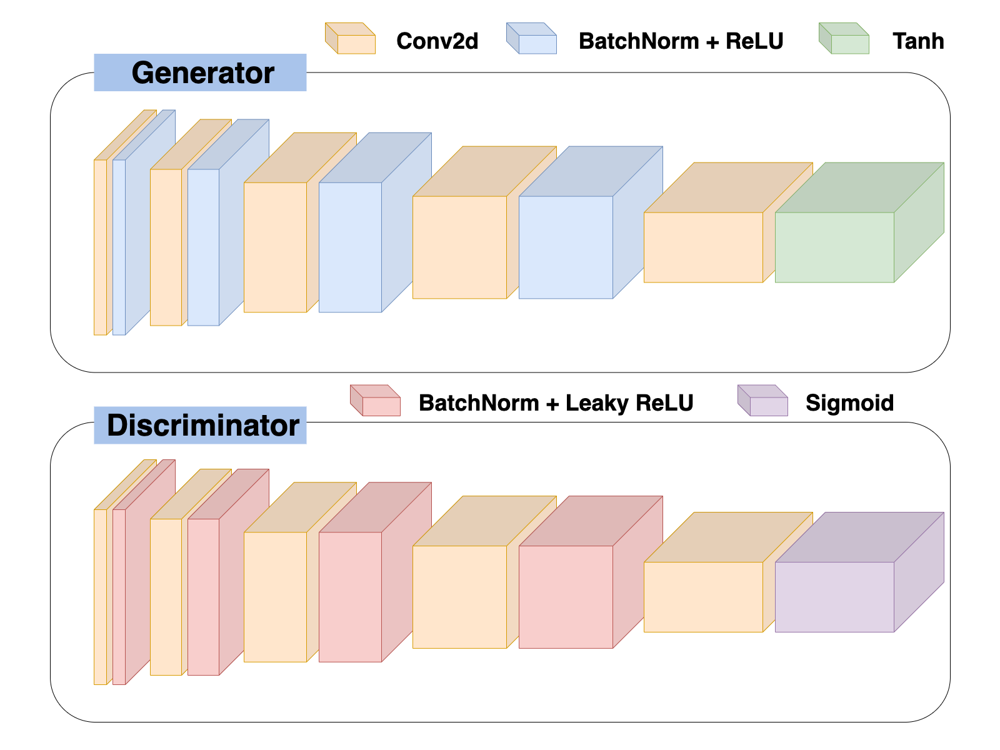

# GANs-for-Speech-Emotion-Recognition-and-Translation

**By**: Nestor Teodoro Chavez and Charudatta Manwatkar

## Introduction
Leveraging the power of deep learning model architectures has been at the forefront of progression in various fields. The agency in which audio processing has accelerated over the last decade has been astonishing. We've seen the power that CNN's hold on images and text. Our aim is to understand and build deep learning models on audio data. 

SER (Speech Emotion Recognition) is a task that focuses and emphasizes the recognition of emotional apsects in speech irrespective of semantic contents. This task partnered with [Neural Style Transfer] (https://en.wikipedia.org/wiki/Neural_style_transfer), in theory, should allow complex model architectures to be trained in order to learn a meaningful way of processing an audio file and translating from one emotion to another. 

--- 

Table of Contents: 
1. [Deep Learning Goal](#goal) 
2. [Dataset](#data) 
3. [Preprocessing Techniques](#techniques) 
4. [Model Architecture](#model) 
5. [Model Performance](#results) 
6. [Next Steps](#next) 
--- 

## <a name="goal">Deep Learning Goal </a>
Our Deep Learning Goal is to leverage General Adversarial Networks in order to recognize the type of emotion from audio files. Our ultimate goal is to modify original audio source in order to generate a new audio file that has been translated to a different emotion. 

## <a name="data">Dataset</a> 
We are using [RAVDESS dataset](https://www.kaggle.com/datasets/uwrfkaggler/ravdess-emotional-speech-audio). The dataset consists of 24 voice actors. These voice actors provide audio in the form of .wav for various sentences and 8 emotions. The emotions we work with are: 
* Neutral
* Calm
* Happy 
* Sad
* Anger 
* Fear
* Disgust
* Surprise. 

## <a name="techniques">Techniques & Preprocessing</a> 
For our analysis, our main focus entailed translating the audio from one emotion to another. The concurrent goal was to classify the emotion from the audio itsef. We started out journey by learning about the model architecture and concepts behind why GANs work. 

As we dove into the project, the first step was to preprocess the audio files from RAVDESS by using Acoustic Feature Extraction. Here, we can see the the audio files that we were initially working with. 

  

  
The next step in this preprocessing was converting these Waveform Audio Files into Mel Spectrograms. The main reason for the conversion was for visualizing the wide spectrum of frequencies over a period of time. This conversion was made possible by leveraging the librosa library in Python. 

  

We then normalize these images. This is a plot of all emotions presented in the RAVDESS dataset that have been normalized. One can note, the mel spectrogram of emotions are all quite similar as the sentence the voice actor is stating is the same but in various varying emotions.  

  

We can get a better sense of the dataset by looking at one more sample. Here, the mel spectrograms are different because the sentence and voice actor are different. 

  

  

## <a name="model">Model Architecture</a>
For our project, we wanted to generate samples that were fake. This was made possible by leveraging [Generative Adversarial Networks](https://en.wikipedia.org/wiki/Generative_adversarial_network). 

  

We paired the GAN architecture with a Convolutional Neural Network, UNet. Based on our analysis, we found the following techniques to be helpful in achieving a high model performance: 
1. **Learning Rate Scheduling:** Adaptive learning rate would allow the model to converge on the global minima in the loss space. We ensure that the learning rate would reduce when validation loss plateuxed every 2 epochs. 
2. **Weight Decay:** Adding weight decay to the optimizzer, a form of regularization, helped in the training by preventing the weights from becoming too small or too large. 
3. **Half Precision Training:** We reduce the float32 values to float16 in order to allow the gradient calculations and the image pixels to reduce in size. This also helped the model train faster and perform quicker back propogation calculations. 
4. **Batch Normalization:** This was another form of regularization that we added contribued to reducing generalization error. It also helped with faster performance on training the model. 
  
## <a name="results">Model Performance</a>
-- insert chart of training/validation --  
-- insert model metrics -- 
  
## <a name="next">Next Steps</a>
We were not able to get the model performance that we originally hoped for. Due to the time constraints, we weren't able to further improve model performance. We propose these additional improvements to increase model performance: 
- **Add More Data** - We would love to merge more audio files from various voice actors in order to help the model generalize and improve overall performance. 
- **Weight Tuning** - We would love to edit the CNN model training to improve its accuracy and performance. This would come in the form of augmenting the Mel Spectrograms; experimenting with various learning rate annealing techniques; and including skip connections in the form of residual blocks to the model architecture. 

---
*This project was done for the course MSDS 631 - Deep Learning, in partial completion of the Masters in Data Science degree program at the University of San Francisco.*
